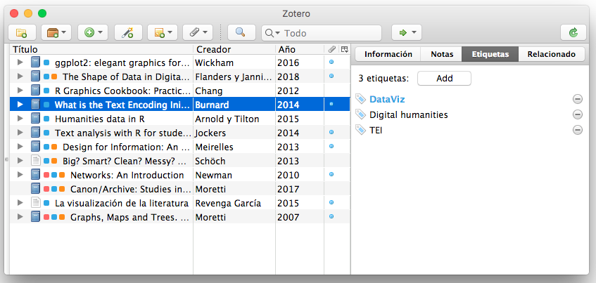
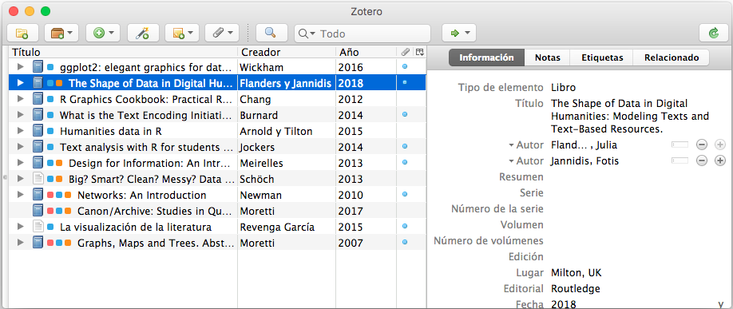

Tratamiento y visualización de datos en las HH.DD. (2ª sesión).
========================================================
title: DH terminology
author: José Luis Losada Palenzuela
date: 25/02/2021
autosize: FALSE

Introducción a la sesión
========================================================

## - Retomamos los primeros pasos en R.
## - Descripción de los datos de trabajo: bibliografía.
## - Zotero (herramienta de gestión bibliográfica). 
## - Manipular y visualizar los datos en R (gráficas, mapas, redes). 

Procedimiento
========================================================

## - Código y datos (completos y disponibles en <https://github.com/editio/dataviz>)
  - 1_scripts_ggplot.R; 2_scripts_maps.R;  3_scripts_redes.R

## - Ejecución.   
  - "Run current line/selection":	Ctrl+Enter (Windows/Linux),	Command+Enter (Mac)

## - Revisión, explicación, ejecución (progresivas) del código  
  
## - Código con explicaciones por escrito en el manual.

Intro rápida a R
========================================================

## - Lenguaje de programación formal. Usa palabras para programar (escribir) una secuencia de comandos (algoritmo): p. ej. contar el nº de palabras.

## - **variable**: lo que nombramos (un nombre asociado a un valor). 

## - **comando o instrucción**: lo que se ordena (siguiendo reglas).

## - **función**: lo que ocurre, lo que sucede.

## - **parámetro**: lo que se necesita, lo que se introduce (en funciones)

Intro rápida a R
========================================================
## - No usamos R aquí _sensu stricto_ como lenguaje de programación, sino como herramienta que dispone ya de funciones predefinidas.

## - Rstudio: consola y paneles.

## - Términos específicos de R.

## - **objeto**: lo que tenemos, lo que manipulamos. 
## - **paquetes**: conjunto de funciones, documentación y datos (opcional).

Datos de trabajo
========================================================

## - Bibliografía de estilometría
## - + 3000 (observaciones)
## - Set de datos real
## - Subconjunto de 91 (observaciones)
## - stylometry_sample.csv
## - asignatura_sample.csv

ggplot2
========================================================

## - paquete: tidyverse o ggplot2
## - principal función: ```ggplot()```
## - sistema de capas: atributos geométricos (puntos, barras,...), estéticos (color, tamaño,...), cálculos estadísticos.
## - otras funciones para las variables: ```aes()```

## - capas añadidas con el signo +

Zotero
========================================================
## Etiquetas
 

Zotero
========================================================
## Autores
  

Redes
========================================================

## - Método de representación de patrones de conexión o interacción entre partes de un sistema. 

## - El concepto de red supone una estructura relacional que puede ser estudiada de forma lógica y matemática: Teoría de grafos (disciplina). 
## - Exploración por medio de la visualización.

Redes. Conceptos básicos
========================================================

## - Red: puntos unidos por líneas.
## - Puntos: **nodos** o vértices ( _nodes_ o _vertices_ ).
## - Líneas: **aristas** o enlaces ( _edges_ o _links_ ).
## - Tipos de redes: redes bipartitas (de afiliación)
  
  -- nodos con características distintas.
  
  -- red bipartita de autores y etiquetas.
