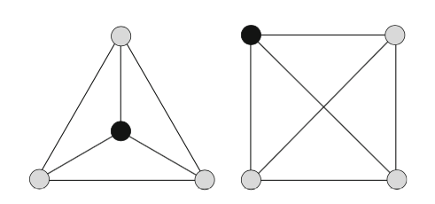

DataViz in DH 
========================================================
title: DH terminology
author: José Luis Losada Palenzuela
date: 25/03/2021
autosize: TRUE
font-family: 'Times New Roman'

Wstęp
========================================================

- Pierwsze kroki w R.

- Opis danych: bibliografia

- Zotero (narzędzie do zarządzania bibliografią).

- Manipulacjia i wizualizacja danych w R (na wykresach, na mapach, w sieciach).


Procedura
========================================================

## Kod i dane [editio/dataviz](<https://github.com/editio/dataviz>)
  - 1_scripts_ggplot.R
  - 2_scripts_maps.R
  - 3_scripts_redes.R

## Uruchomić kodu w konsoli (_console_)
  - R używa wiersz poleceń (_command-line_)
  - "Run current line/selection":	Ctrl+Enter (Windows/Linux),	Command+Enter (Mac)

## Przeglądnie, omawianie, (progresywne) uruchomianie kodu
  
Krótkie wprowadzenie do R
========================================================

Formalny język programowania: używa słów, aby zaprogramować (napisać) kod (algorytm): n.p., policzyć liczbę słów. 

Srodowiska do obliczeń statystycznych oraz wizualizacji wyników.

- **_variable_** (zmienna): to, co nazywamy (nazwa związana z wartością). 
- **_command/instruction_** (wyrażenie, polecenia, instrukcja): to, co polecamy (kierując się zasadami).
- **_function_** (funkcja): to, co się dzieje, się wykonuje
- **_argument_** (argument, parametr): to, co modyfikuje, co jest wpisane (w funkcjach)
- **_operator_** (operator): to, co przypisywa, co łączy.

Krótkie wprowadzenie do R
========================================================
-  Nie używamy R _sensu stricto_ jako języka programowania, ale jako narzędzie, które ma już przedefiniowane funkcje.

- Rstudio (środowisko programistyczne, IDE): Konsola oraz panele/okna

## Terminologia specyficzna dla R.

- **_object_** (obiekt): to, co mamy, co manipulujemy. 
- **_package_** (pakiet): zestaw funkcji, dokumentacji i danych (opcjonalnie).

Zewstaw danych w materiałach
========================================================

- Bibliografia stylometrii

- ok. 3000  (obserwacji)

- Zestaw danych rzeczywistych

- Podzbiór 91 (obserwacji)

- stylometry_sample.csv

- asignatura_sample.csv


ggplot2
========================================================

- pakiet: tidyverse albo ggplot2

- główna funkcja: ```ggplot()```

- system warstwowy: atrybuty geometryczne (punkty, słupki, ...), estetyka (kolor, rozmiar, ...), obliczenia statystyczne.

- inne funkcje dla zmiennych: ```aes()```

- warstwy dodane ze znakiem (operatorem) **+**

Zotero (tags)
========================================================
 

Zotero (autor)
========================================================
  

Sieci (networks)
========================================================

- Metoda reprezentacji połączeń lub wzorców interakcji między częściami systemu. 

- Pojęcie sieci zakłada strukturę relacyjną, którą można badać logicznie i matematycznie: **Teoria grafów** (dyscyplina)
- Eksploracja poprzez wizualizację.

Sieci. Podstawowe pojęcia
========================================================

- Sieć: punkty połączone liniami.
- Punkty: **węzły** lub wierzchołki (_nodes_ albo _vertices_).
- Linie: **krawędzie** (_edges_ albo _links_).
- Rodzaje sieci: sieci dwudzielny (_bipartite_, _affiliation graph_)
  - graf, którego wierzchołki można podzielić na dwa rozłączne zbiory
  - sieci dwudzielny autorów i etykiet.

Sieci. Uwagi do wyzualizaji
========================================================



- Algorytmy do rysowania grafów w sposób wizualnych. 
- Algorytm _Force Atlas_ bazuje na balansie sił, biorąc pod uwagę wagę krawędzi.
